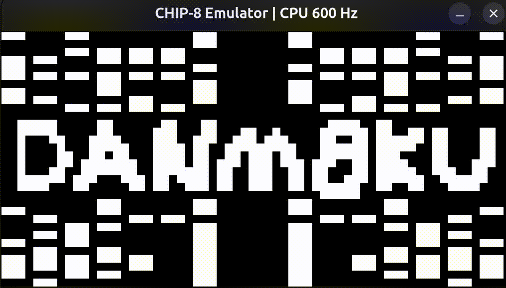

# chip8-emu-core

This repo contains a CHIP-8 emulator written library in ANSI C. You can use this library to build your own CHIP-8 emulator application. There is an example frontend application included built with SDL2 in C99.



## Getting Started
To clone the repository, run:

```bash
git clone git@github.com:BenJSouthwell/chip8-emu-core.git
```
To build the library, run:

```bash
cd chip8-emu-core
mkdir build
cd build
cmake ..
make
```

This will create a static library `libchip8emu_lib.a` in the `build` directory. You can use this, along with `include/chip8.h`, to integrate the CHIP-8 emulator into your own applications. See [Using it as a CMake Dependency](#using-it-as-a-cmake-dependency) below for instructions.


## Building the SDL Frontend

To build the SDL frontend along with the library, run:

```bash
cd chip8-emu-core
mkdir build
cd build
cmake .. -DBUILD_FRONTEND=ON
make
```

This will build the example SDL executable `chip8emu_sdl` in the `build` directory.

### Frontend Usage
To run the SDL frontend, navigate to the `build` directory and run:

```bash
./chip8emu_sdl ../roms/snek.ch8
```
Replace `../roms/snek.ch8` with the path to any CHIP-8 ROM you want to run.

Note: The frontend is only built when the `BUILD_FRONTEND` option is enabled during the CMake configuration step.

To quit the emulator, press the `ESC` key.
To change the CPU clock rate, use the `+` and `-` keys.
The original CHIP-8 keypad physical layout is as follows:
```
1 2 3 C
4 5 6 D
7 8 9 E
A 0 B F
```
On QWERTY keyboards we perform the following mapping (QWERTY on the left, CHIP-8 on the right) in the SDL frontend:
```
1 2 3 4  -> 1 2 3 C
Q W E R  -> 4 5 6 D
A S D F  -> 7 8 9 E
Z X C V  -> A 0 B F
```

### ROMs
There are some example CHIP-8 ROMs you can use to test the emulator located in the `/chip8-emu-core/roms/` directory. These are public domain ROMs sourced from [here](https://johnearnest.github.io/chip8Archive/?sort=platform#chip8) released under the [creative commons zero](https://creativecommons.org/public-domain/cc0/) license.

I also recommend checking out [this collection](https://github.com/Timendus/chip8-test-suite) for testing.

## Using it as a CMake Dependency

To use this library in your CMake project, add it as a subdirectory and link against it:

```cmake
# Add the chip8-emu-core library to your project
add_subdirectory(path/to/chip8-emu-core)

# Link your executable against the library
add_executable(my_emulator main.c)
target_link_libraries(my_emulator PRIVATE chip8emu::chip8emu_lib)
```

The library will automatically provide the correct include directories, so you can simply include the header in your code:

```c
#include "chip8.h"

int main() {
    struct chip8 *emu = initialise_chip8(CHIP8_CLOCK_RATE_600Hz);
    // Your emulator code here...
    free_chip8(emu);
    return 0;
}
```

## API
You only need to include the `chip8.h` header file to use the library. The following functions and structures are all that you need to interface with the emulator. See the header file for documentation comments.

```c
struct chip8 *initialise_chip8(enum chip8_clock clock);
struct chip8_io *get_io_chip8(struct chip8 *p);
int load_rom_chip8(struct chip8 *p, uint8_t *data, uint16_t num_bytes);
void execute_cycle_chip8(struct chip8 *p);
int change_clock_rate_chip8(struct chip8 *p, enum chip8_clock clock);
void free_chip8(struct chip8 *p);
```
### chip8_io Structure
This structure is used to interface with the emulator for both input and output. It's internal state in the chip8 struct. You can get a pointer to the chip8_io struct using the `get_io_chip8` function. 
```c
struct chip8_io
{
    /* inputs */
    uint8_t     keypad_state[16];
    /* outputs */
    uint8_t     fbuff[CHIP8_SCREEN_WIDTH * CHIP8_SCREEN_HEIGHT];
    char        update_display;
    char        buzzer_active;            
};
```
The `keypad_state` array is used to set the state of the 16 keys on the CHIP-8 keypad. The `fbuff` array contains the current state of the framebuffer, which is 64x32 pixels. Each pixel is represented as a byte, where 0 is off and 1 is on. The `update_display` flag is set to 1 when the display needs to be updated, and the `buzzer_active` flag is set to 1 when the buzzer should be active.


### chip8_clock Rates
These are the valid enums you can use to initialize the emulator with different clock rates or change the clock rate at runtime. The values are just the clock rate divided by 60. This is used internally as a clock divider to run the delay and sound timers at 60Hz. The caller is responsible for calling `execute_cycle_chip8` the appropriate number of times per second to achieve the promised clock rate.
```c
enum chip8_clock
{
    CHIP8_CLOCK_RATE_300Hz = 5,
    CHIP8_CLOCK_RATE_360Hz = 6,
    CHIP8_CLOCK_RATE_420Hz = 7,
    CHIP8_CLOCK_RATE_480Hz = 8,
    CHIP8_CLOCK_RATE_540Hz = 9,
    CHIP8_CLOCK_RATE_600Hz = 10,
    CHIP8_CLOCK_RATE_660Hz = 11,
    CHIP8_CLOCK_RATE_720Hz = 12,
    CHIP8_CLOCK_RATE_780Hz = 13,
    CHIP8_CLOCK_RATE_840Hz = 14,
    CHIP8_CLOCK_RATE_900Hz = 15
};
```

## Example Usage
You can also see frontend/main.c for a complete example.
```c
struct chip8 *emu = initialise_chip8(CHIP8_CLOCK_RATE_600Hz);
struct chip8_io *io = get_io_chip8(emu);
load_rom_chip8(emu, rom_data, rom_size);

while (running) {
    // Example: Set keypad_state based on your input system
    // io->keypad_state[0x1] = is_key_pressed(KEY_1) ? 1 : 0;
    // io->keypad_state[0x2] = is_key_pressed(KEY_2) ? 1 : 0;
    // ... etc for all 16 keys
    
    execute_cycle_chip8(emu);
    
    if (io->update_display) {
        // Render io->fbuff to your display
        // Each pixel is 1 byte: 0 = off, 1 = on
        // Display is 64x32 pixels
    }
    if (io->buzzer_active) {
        // Play beep sound
    }
}

// Don't forget to clean up
free_chip8(emu);
```

## Contributing

Contributions are welcome! I have run through some basic testing and got [this collection](https://github.com/Timendus/chip8-test-suite) of test ROMs mostly happy. However, if you find any gremlins or have suggestions for improvements, please feel free to open an issue or submit a pull request.

## License

This project is licensed under the MIT License. See the [LICENSE](./LICENSE) file for details. 
